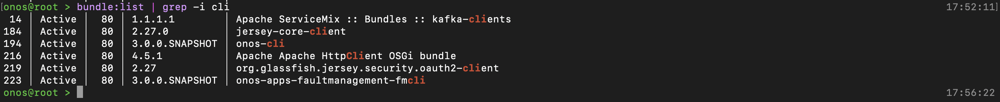
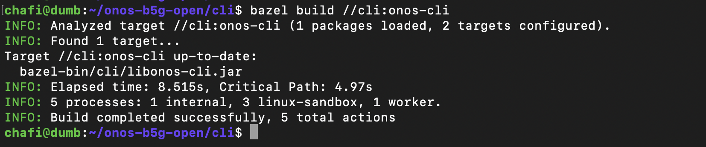
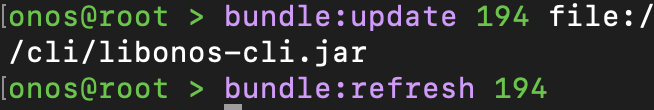
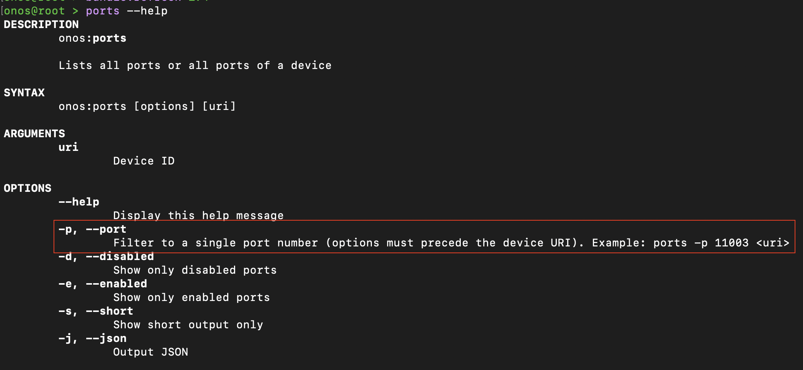
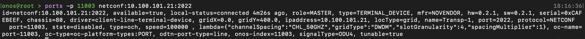

# The target is to keep ONOS running and Rebuild an App

Rebuilding the whole application is time consuming. That's why we have an option to rebuild and refresh one specific app. Let's do it with our first app modification:

## Modify your java code accordingly

Add your code snippet into desired file and save everything.

## Rebuild the app again

For example I am building the `CLI` app with new modifications:

- I have added my code
- I will check which bundle the CLI belongs to
    ```bash
    #in ONOS CLI
    bundle:list
    ```
    prints a list of application bundles that is running the applications.
- Our CLI app bundle is:

    
    ~ 194 │ Active │  80 │ 3.0.0.SNAPSHOT │ onos-cli
- Now we will rebuild it

    ```bash
    #from the /cli directory, there should be a BUILD file
    bazel build //cli:onos-cli
    # //cli is the folder from the root
    # onos-cli is the bundle name(see the image above)
    ```

    Must give you an output like this:

    
- Now we have to find where the `.jar` file is
    ```bash
    bazel info bazel-bin
    #output: /home/user/.cache/bazel/_bazel_user/0d38f5ecc3a2e94bd7c7cc5483405927/execroot/org_onosproject_onos/bazel-out/k8-fastbuild/bin/
    cd /home/user/.cache/bazel/_bazel_user/0d38f5ecc3a2e94bd7c7cc5483405927/execroot/org_onosproject_onos/bazel-out/k8-fastbuild/bin/
    cd cli
    # you will see the file: libonos-cli.jar
    #because build output showed this file as output
    #most cases libonos-* is the desired file
    ```
- Installing the new file

    ```bash
    #from onos-cli
    bundle:update id file:/full-path-of-the-file
    bundle:refresh id
    ```
    

At this point if you see the log, you will see it's loading the new information. Let's check if it worked:



We now have the option to filter a specific port.

