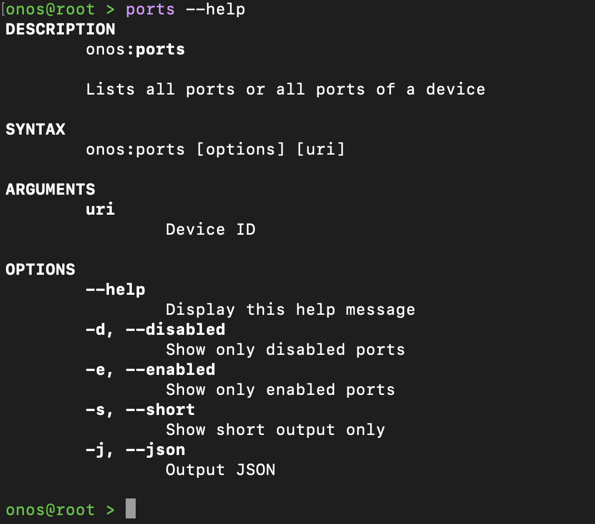

# Adding new options in existing CLI features

We tried to add the port number of an optical-device to see spefici configuration and lambdas. Let's see the process:

## What we had before

We did not have any option to filter one specific port. This option just gives you an option to fetch one specific port and see it's details. 

But to do that we have to modify the existing code snippets and build the application once again. If you don't want to **build from scratch again** to save time, you can build specific app and reload it. Checkout this documentation to know the [process](../apps/REBUILD.md).


```bash
ports --help
```

