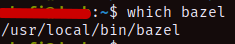
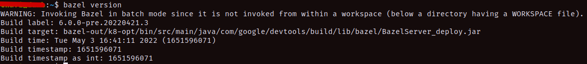
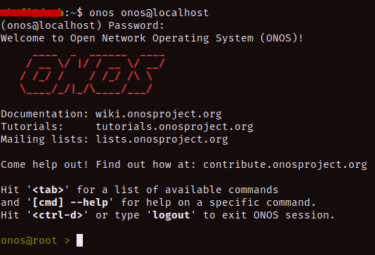
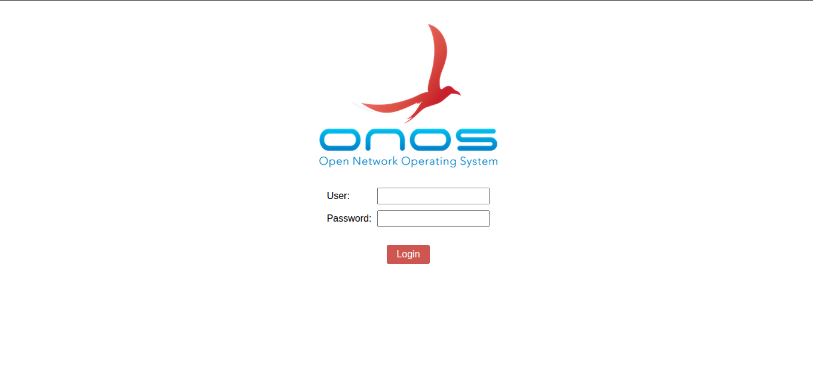

# Building ONOS from Source

This tutorial explains how to build and run ONOS from source. The steps have been tested on:

- Ubuntu 20.04 LTS
- Ubuntu 22.04 LTS

It is recommended to use a clean system or virtual machine (VM), as the setup configures development dependencies and system-level tools.

## Install the Dependencies

Install the required build dependencies, Java 11 development kit, and Python toolchain:

```bash
sudo apt update && sudo apt install -y python2 build-essential perl curl wget zip bzip2 openjdk-11-jdk screen xterm
```

### Install Bazel

Download the required binary release of Bazel:

```bash
wget https://releases.bazel.build/6.0.0/rolling/6.0.0-pre.20220421.3/bazel-6.0.0-pre.20220421.3-linux-x86_64
```

Make the binary executable and move it to `/usr/bin/` so that it is globally available in your `$PATH`:

```bash
chmod +x bazel-6.0.0-pre.20220421.3-linux-x86_64
sudo mv bazel-6.0.0-pre.20220421.3-linux-x86_64 /usr/bin/bazel
```

Verify the installation:

```bash
which bazel    # Displays the binary path (/usr/bin/bazel)
bazel version  # Displays the Bazel version details
```

You should see output similar to:




### Clone the Repository

Clone the `onos-classic` repository:

```bash
git clone https://github.com/alessiocnit/onos-classic.git
cd onos-classic
```

### Configure Environment Variables

Add the ONOS environment variables to your user profile (`~/.bashrc`):

```bash
# Add ONOS_ROOT and source development shortcuts to ~/.bashrc
echo "export ONOS_ROOT=$(pwd)" >> ~/.bashrc
echo "source \$ONOS_ROOT/tools/dev/bash_profile" >> ~/.bashrc

# Reload .bashrc for current session
source ~/.bashrc
```

> [!NOTE]
> If you prefer editing manually, open `nano ~/.bashrc` (without `sudo`), go to the bottom of the file, append the `export ONOS_ROOT=...` and `source` lines, and save.

Verify the variable is properly set:

```bash
cd $ONOS_ROOT
pwd
```

### Build and Run ONOS

From within the `onos-classic` root directory, trigger the build:

```bash
ok clean
```

- This command runs `bazel` via the ONOS development profile and builds all necessary targets.
- The initial compilation will take several minutes to complete depending on your hardware.
- Once the build finishes, the ONOS controller will launch in the foreground in the same terminal. Keep this terminal running.

### Connect to the CLI

Open a **new terminal** window and log into the ONOS CLI:

```bash
onos onos@localhost
```

When prompted, enter the default password: **`rocks`**.



### Access the Web GUI

Open your web browser and navigate to:
- **URL**: [http://localhost:8181/onos/ui](http://localhost:8181/onos/ui)
- **Username**: `onos` (or `karaf`)
- **Password**: `rocks` (or `karaf`)


