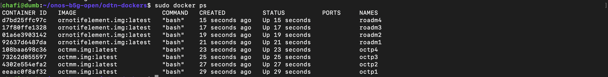
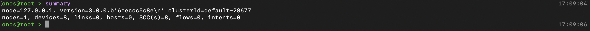
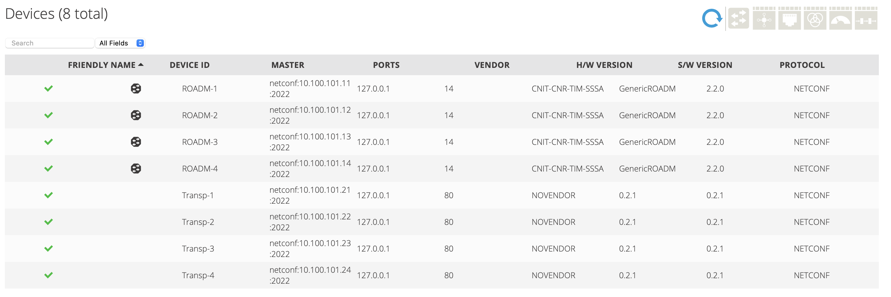
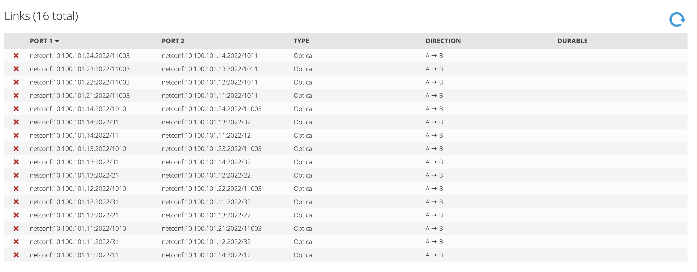

# To run the topology for the first time

We are doing a fresh installation here.

```bash
sudo docker load --input oc.tar
sudo docker load --input or.tar
```

## Create the bridge network so that host can connect the containers

```bash
sudo docker network create --driver=bridge --ip-range=10.100.101.0/24 --subnet=10.100.101.0/24 -o "com.docker.network.bridge.name=br0" netbr0
```

## Create the topology

```bash
sudo ./createTopoB5G.sh
```

Make sure you have these containers running in docker:



## Adding the devices

Before adding the devices we have to enable several drivers and services from ONOS. You can do it from GUI > Applications or from the CLI. We are using CLI:

**N.B:** The commands are executed in a batch(queue) in onos. So, if you execute one after another they will not collide with one another. But if you want to understand if the command has been executed, you can open the logs(the server is already running then that's the log) and look for the pointer. Until the command is not finished, it keeps blinking. Sometimes it's necessary because if the ODTN-DRIVER is not finished activating and you post the devices and links, you will most likely see nothing.

```bash
#I am assuming you are already logged in
onos onos@localhost #provide password

#activate ODTN-DRIVER, LUMEN, NETCNFGLINKPROVIDER
app activate org.onosproject.drivers.odtn-driver
app activate org.onosproject.drivers.lumentum
app activate org.onosproject.netcfglinksprovider
```

Now in another terminal get inside the b5g-scripts folder:

```bash
cd b5g-scripts #from ONOS_ROOT

sudo ./addDevicesB5G.sh
```

After that you must have this scenarios:




Let's post our links now:

```bash
sudo ./addLinksB5G.sh
```



## Adding an Intent

This part is optional, we need it to see our intents from one point to another. And this intent actually proves that are channels are working with specific width, frequency and mode.

```bash
sudo ./addOneIntentB5G.sh
```

## If you want to access the NETCONF server running our OPENROADM

The `netconf` is running through `confd` inside the container. To access the `confd` server through ssh:

```bash
sudo docker exec -it roadm1 bash
#from inside the container bash
ssh -s -p 2022 admin@127.0.0.1 netconf #password is: admin
```

Now you will be directed to the capabilities `<hello>` message.
